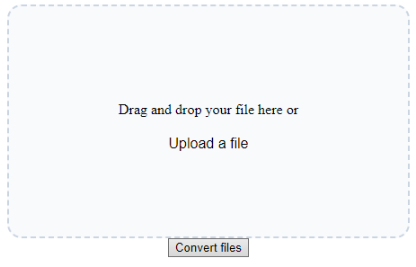

# JPG-to-PNG

## How it works
The application has a really simple design, as you may see, you can upload your files to the website by dragging them to this square or click at "upload a file" and select the file you want.
When a file is uploaded there is a counter, on this counter you can confirm that your file has been uploaded and see the quantity of files you have uploaded.
After uploading everything you wanted, click in convert files button, and you are going to download every file converted.

